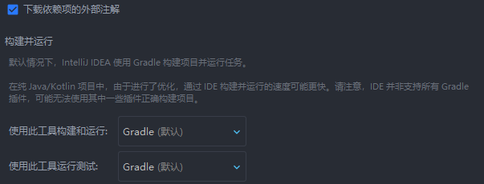
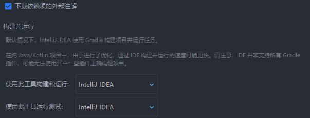

# 使用IDEA构建项目

通常，你会使用gradle直接构建你的mod project。

但如果你是用IDEA作为开发工具，你还有另一个选择，就是使用IDEA作为构建工具（即 intellj gradle）。

## IntelliJ gradle的优势:

- 更快的构建速度
- 更简单的代理设置，你只需要在idea配置好代理设置就可以给gradle挂上代理
- hotswap（热重载） 更快

**注意! loom(Fabric loom/Arch loom等)不支持使用IntelliJ gradle**

## 用法

你只需要在 ```文件 > 设置 > 构建、执行、部署 > 构建工具 > Gradle``` 处，将下面两个选项：


改为：



之后再在```文件 > 设置 > 外观与行为 > 系统设置 > HTTP代理``` 处设置好代理就可以解决大部分toolchain的代理挂不上问题。