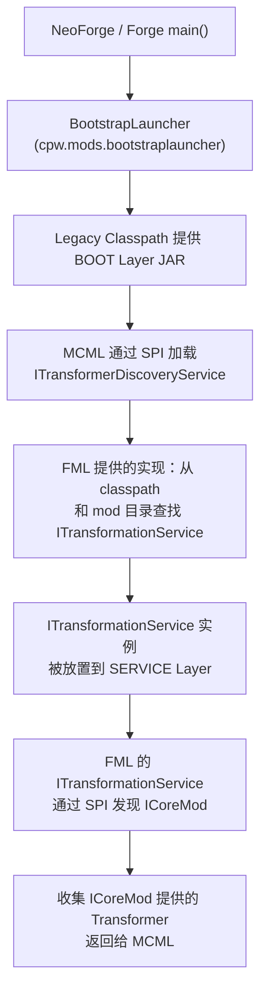
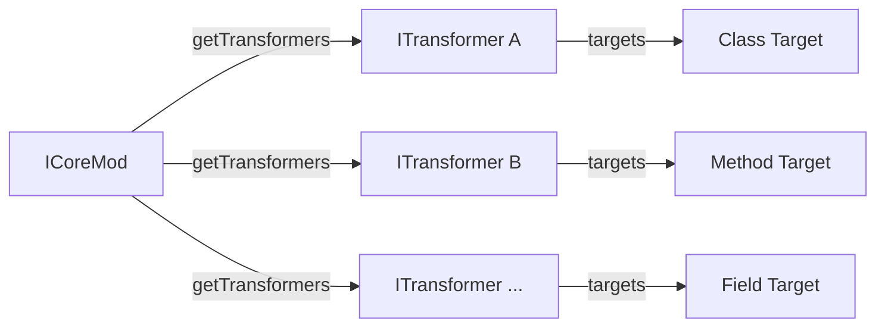
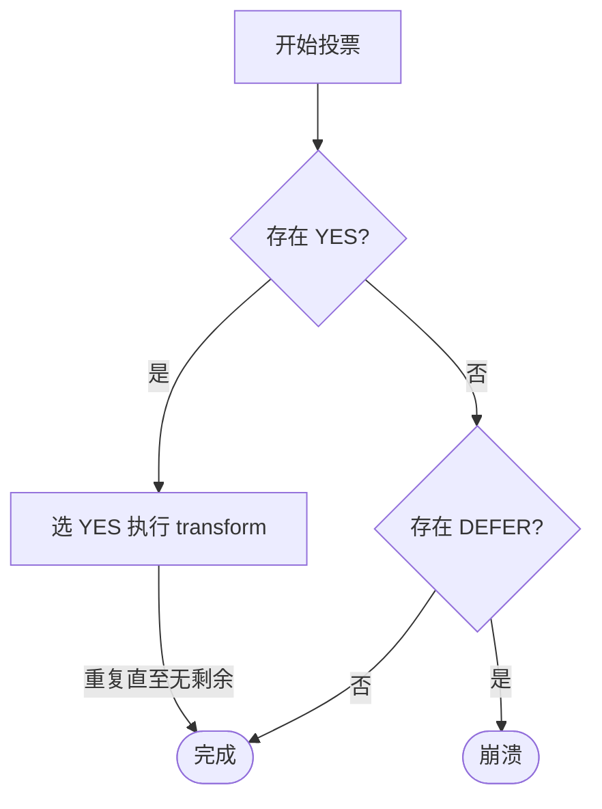

# 1.20.6 ~ 1.21.8

自 NeoForge 从 Forge 分叉以后，JS Coremod 被事实上废弃，Java Coremod 被重新添加回来。不过和 1.20.1 时期相比，NeoForge 的 Java Coremod 体系经过重新设计，不再像过去那样难以使用。通常情况下，开发者不再需要直接使用 `ITransformationService` 的 ModLauncher API 来实现类变换；与此同时 ModLauncher 本身也被合并进了 FML，为之后更大规模的重构做了铺垫。

> 本章仅讨论 Java Coremod 机制本身，Mixin 相关内容见 [Mixin（通用）](./mixin-basics) 章节。

---

## 加载流程

> 本节为可选内容，不影响后续章节阅读。

::: details 加载流程分析

整个过程从 NeoForge / Forge 提供的特殊 main 函数开始，进入 `cpw.mods.bootstraplauncher.BootstrapLauncher`（来自 MC ModLauncher 项目，以下简称 MCML）。



Legacy classpath 首先提供了 BOOT Layer 所需的 JAR。之后 MCML（MC ModLauncher）通过 Java SPI 加载 `ITransformerDiscoveryService`，该接口的实现通常由 FML 提供。FML 的 `ITransformerDiscoveryService` 负责从 classpath 和 mod 目录中查找 `ITransformationService`。

被发现的 `ITransformationService` 实例会被放置到 **SERVICE Layer**。随后 FML 自身提供的一个 `ITransformationService` 会通过 SPI 扫描 `ICoreMod`，将各 `ICoreMod` 返回的 `ITransformer` 汇总后提交给 MCML，完成 CoreMod 的注册。

:::

::: info 相关接口

| 接口 | 职责 |
|---|---|
| `ITransformerDiscoveryService` | 发现并过滤 `ITransformationService`，启动阶段完成后不再动作 |
| `ITransformationService` | 向 MCML 提供 `ITransformer`；FML 通过它加载 `ICoreMod` 并将 Transformer 提交给 MCML |

> 提交额外 JAR 的功能现在主要由 `net.neoforged.neoforgespi.locating.IDependencyLocator` 和 `net.neoforged.neoforgespi.locating.IModFileCandidateLocator` 替代。

:::

::: details 补充：Mixin 与 AccessTransformer 的实现方式

Mixin 和 AccessTransformer 在广义上也属于 CoreMod —— 它们同样进行 ClassTransforming，且加载时机早于游戏。不同的是，它们基于另一套 API：`cpw.mods.modlauncher.serviceapi.ILaunchPluginService`，面向被 Forge / NeoForge 捆绑的库，能收到**所有** `ClassNode`（而非通过 `targets()` 筛选），不受 `ITransformer` 的 Target 和投票机制约束。

:::

---

## API 与机制

### CoreMod 发现机制：Java SPI

NeoForge 通过 Java SPI 发现和加载 `net.neoforged.neoforgespi.coremod.ICoreMod` 接口的实现。在 `META-INF/services/` 下声明实现类即可：

<FileTree :structure="[
  { name: 'src/main/resources/', children: [
    { name: 'META-INF/', children: [
      { name: 'services/', children: [
        { name: 'net.neoforged.neoforgespi.coremod.ICoreMod', note: '实现类全限定名' }
      ]}
    ]}
  ]}
]" />

文件内容为实现类全限定名，每行一个：

```
com.example.coremod.ExampleCoreMod
```

::: info SPI 加载时机
SPI 服务在 FML 启动的极早期阶段被扫描，早于任何 `@Mod` 构造器调用，因此 Coremod 不需要 `neoforge.mods.toml` 和 `@Mod` 注解即可被加载。
:::

### ICoreMod 与 ITransformer

`ICoreMod` 接口的职责是返回一组 `ITransformer`：

```java
public interface ICoreMod {
    List<ITransformer<?>> getTransformers();
}
```

每个 `ICoreMod` 可管理多个 `ITransformer`，一个 Transformer 通常只处理一种目标类型：



### ITransformer

`ITransformer<T>` 是核心变换接口，泛型参数 `T` 由 `TargetType` 决定：

| `TargetType` | `T` 的实际类型 |
|---|---|
| `CLASS` | `ClassNode` |
| `PRE_CLASS` | `ClassNode`（早于 CLASS，用于在其他加载操作之前介入） |
| `METHOD` | `MethodNode` |
| `FIELD` | `FieldNode` |

::: tip 虽然 `ClassNode` 已包含类的全部信息，理论上用 `CLASS` Target 即可访问所有字段和方法；但使用 `METHOD` 或 `FIELD` 等更具体的 Target 类型可以让 ModLauncher 完成初筛，减少手动过滤的工作量。
:::

`Target<T>` 是一个 record 类型，建议通过工厂方法创建：

```java
Target.targetClass("net/minecraft/world/World")
Target.targetPreClass("net/minecraft/world/World")
Target.targetMethod("net/minecraft/world/World", "tick", "()V")
Target.targetField("net/minecraft/world/World", "isRemote")
```

#### castVote 投票机制

`castVote` 确定当前目标是否应被修改。每轮投票中，ModLauncher 遍历所有 Transformer 并收集投票结果：

| 返回值 | 含义 |
|---|---|
| `YES` | 当前 Transformer 为候选人，希望在本轮执行变换 |
| `NO` | 退出本轮投票 |
| `DEFER` | 推迟，等待后续轮次 |
| `REJECT` | 拒绝，直接导致游戏崩溃 |



::: danger 不要使用 REJECT
源码中明确标注：*"This is extremely frowned upon, and should not be used except in extreme circumstances."* 不兼容检测应放在 `ITransformationService#onLoad` 中处理，而非在 `castVote` 中通过 `REJECT` 终止游戏。
:::

#### 完整示例

项目文件结构：

<FileTree :structure="[
  { name: 'src/main/java/com/example/coremod/', children: [
    { name: 'ExampleCoreMod.java' },
    { name: 'ExampleClassTransformer.java' }
  ]},
  { name: 'src/main/resources/', children: [
    { name: 'META-INF/', children: [
      { name: 'services/', children: [
        { name: 'net.neoforged.neoforgespi.coremod.ICoreMod' }
      ]}
    ]}
  ]}
]" />

`ExampleCoreMod.java`：

```java
package com.example.coremod;

import cpw.mods.modlauncher.api.ITransformer;
import net.neoforged.neoforgespi.coremod.ICoreMod;
import java.util.List;

public class ExampleCoreMod implements ICoreMod {

    @Override
    public List<ITransformer<?>> getTransformers() {
        return List.of(new ExampleClassTransformer());
    }
}
```

`ExampleClassTransformer.java`：

```java
package com.example.coremod;

import cpw.mods.modlauncher.api.*;
import org.objectweb.asm.tree.ClassNode;
import java.util.*;

public class ExampleClassTransformer implements ITransformer<ClassNode> {

    @Override
    public Set<Target<ClassNode>> targets() {
        return Set.of(Target.targetClass("net/minecraft/world/World"));
    }

    @Override
    public TransformerVoteResult castVote(ITransformerVotingContext context) {
        return TransformerVoteResult.YES;
    }

    @Override
    public ClassNode transform(ClassNode input, ITransformerVotingContext context) {
        // 在此处操作 ASM ClassNode
        return input;
    }

    @Override
    public TargetType<ClassNode> getTargetType() {
        return TargetType.CLASS;
    }

    @Override
    public String[] labels() {
        return new String[] { "example_class_transformer" };
    }
}
```

`transform` 方法内部的 ASM 字节码操作不属于本章讨论范围。

---

::: warning Coremod 所在的 Layer 及其限制

Coremod 运行在 **Plugin Layer**，不需要 `neoforge.mods.toml` 和 `@Mod` 注解即可被加载。Plugin Layer 处于 Mod Layer 之下，因此 Mod Launcher 的 Transform API 无法对 Coremod 自身进行修改，只能修改 **GAME Layer** 中的类，详见 [Module Layer](./game-layer)。

:::


---

::: warning CoreMod 与普通 Mod 的共存限制

CoreMod（通过 SPI 加载）和普通 Mod（通过 `@Mod` 注解 + `neoforge.mods.toml` 加载）**不能同时存在于同一个 JAR 中**。根本原因是 ModLauncher 和 FML 的模块化分层设计：CoreMod 运行在 Plugin Layer，普通 Mod 运行在 GAME Layer，两者在不同的模块加载路径上，若放入同一 JAR 会导致模块重复导出（duplicate module export）异常。

但可以通过 **Jar-in-Jar** 的方式互相提供：普通 Mod 以 Jar-in-Jar 内嵌 CoreMod，或者 Coremod 以 Jar-in-Jar 内嵌普通 Mod。在某些情况下必须采用后一种方式，详见 [Early Service](./early-service)。

:::


::: details 补充：Mod 的 Mixin 类与 CoreMod

Mod 的 Mixin 类虽然属于 Mixin 框架管理，但它们在运行时处于 **GAME Layer**。因此 CoreMod 的 `ITransformer` 实际上可以对 Mod 的 Mixin 类进行 transforming——只要该类在 GAME Layer 中，就受 `TransformingClassLoader` 管辖。

:::

---

## 项目实战

通常情况下，我们需要 CoreMod 和普通 Mod 共存于同一个项目中。根据前文所述，两者不能放在同一个 JAR 中，因此必须通过 **Jar-in-Jar** 将它们隔离为两个独立的 JAR，同时注意不能存在重复的包路径，否则会触发模块导出异常。

下面基于 [CoremodExample (1.20.6-1.21.8)](https://github.com/vfyjxf/CoremodExample/tree/1.20.6-1.21.8) 介绍具体做法。

### 项目结构

使用 Gradle Subproject 实现编译期类隔离和 CoreMod 分离：

<FileTree :structure="[
  { name: 'CoremodExample/', children: [
    { name: 'settings.gradle' },
    { name: 'build.gradle' },
    { name: 'gradle.properties' },
    { name: 'src/main/java/com/example/examplemod/', children: [
      { name: 'ExampleMod.java' },
      { name: 'Config.java' }
    ]},
    { name: 'src/main/resources/META-INF/', children: [
      { name: 'neoforge.mods.toml' }
    ]},
    { name: 'coremod/', children: [
      { name: 'build.gradle' },
      { name: 'src/main/java/com/examplemod/coremod/', children: [
        { name: 'ExampleCoremod.java' },
        { name: 'ExampleTransformer.java' }
      ]},
      { name: 'src/main/resources/META-INF/services/', children: [
        { name: '...ICoreMod', note: 'SPI 声明' }
      ]}
    ]}
  ]}
]" />

### settings.gradle

注册 subproject：

```groovy
include(":coremod")
```

### coremod/build.gradle

CoreMod 子项目的构建脚本，手动填入必要的依赖，并为 JAR 添加 `FMLModType: LIBRARY` 标记：

```groovy
plugins {
    id 'java'
}

java {
    toolchain {
        languageVersion = JavaLanguageVersion.of(21)
    }
}

repositories {
    maven {
        url = "https://libraries.minecraft.net"
    }
    maven {
        url = "https://maven.neoforged.net/releases"
    }
}

dependencies {
    compileOnly 'net.neoforged.fancymodloader:loader:4.0.1'
}

jar {
    manifest {
        attributes(
            "FMLModType": "LIBRARY"
        )
    }
}
```

`FMLModType: LIBRARY` 的作用是让 FML 将该 JAR 识别为库而非独立 Mod，从而与主项目的 Mod 协同工作。在开发环境中配合 `localRuntime` 即可加载。

### 主项目 build.gradle

在主项目中通过 Jar-in-Jar 将 CoreMod 子项目内嵌：

```groovy
configurations {
    runtimeClasspath.extendsFrom localRuntime
}

dependencies {
    jarJar(localRuntime(project(":coremod")))
}
```

::: warning Jar-in-Jar 仅在打包时生效
`jarJar` 只在生产构建（打包为 JAR）时执行。开发环境中需要 `localRuntime(project(":coremod"))` + CoreMod 子项目的 `FMLModType: LIBRARY` manifest 配合，才能让 FML 正确识别并加载。

此外，确保 CoreMod 子项目和主项目之间**不存在重复的包路径**，否则运行时会抛出模块重复导出异常。
:::

如果只需要 CoreMod 而不需要普通 Mod，可以省略主项目，直接按照 `coremod/` 子项目的结构编写 —— 配置 `settings.gradle`、`build.gradle`，打包后即可作为独立的 CoreMod 使用，无需 Jar-in-Jar 和相关隔离措施。