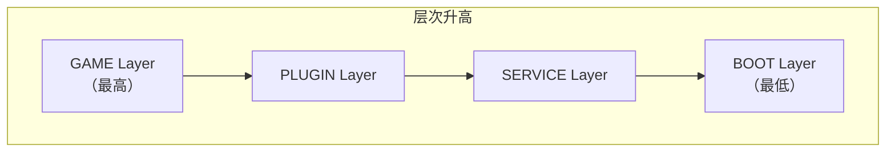

# ModLauncher / FML Module Layer

Layer 是 ModLauncher 引入的一项设计，它将 JVM 中的类和资源按层次分割，每一层使用独立的 ClassLoader 进行加载。Layer 的定义来自 `cpw.mods.modlauncher.api.IModuleLayerManager.Layer`。

---

## Layer 层次

ModLauncher 定义了四个 Layer，从低到高依次为：

Layer 遵循与 Java ClassLoader 相同的隔离规则：**parent 无法访问 child 加载的类**。层次越高，可见的类越多。

---

## 各 Layer 内容

| Layer | 包含内容 |
|---|---|
| **BOOT** | 游戏依赖库（Guava 等），JDK 基础类库 |
| **SERVICE** | ModLauncher 自身的服务，例如 FML 在这一层加载 |
| **PLUGIN** | Mixin、以 Jar-in-Jar 方式加入且 `FMLModType` 不为 `GAMELIBRARY` 的非 Mod 内容 |
| **GAME** | Minecraft 本体、Mod 类、NeoForge Mod API |

::: info PLUGIN 与 SERVICE 的可见性
PLUGIN Layer 在加载顺序上晚于 SERVICE Layer，但两者能访问到的类范围是**相同**的。
:::

---

## GAME Layer 的特殊性

四个 Layer 中，**只有 GAME Layer 使用了 `TransformingClassLoader`**。这意味着 ModLauncher 提供的 Transform API 仅对 GAME Layer 中的类生效，其他三个 Layer（BOOT、SERVICE、PLUGIN）中的类**不可被变换**。

这个设计保证了：
- Coremod 只能修改 Minecraft 本体和 Mod 的类，不会触及 ModLauncher 自身和基础设施
- Plugin Layer 层的 Mixin、Coremod 自身也无法被其他 Coremod 修改
